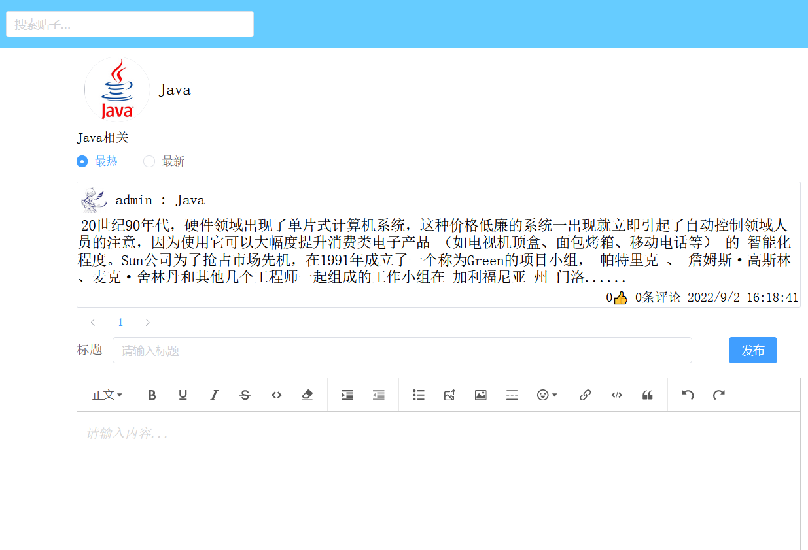
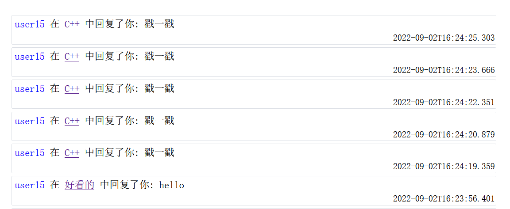
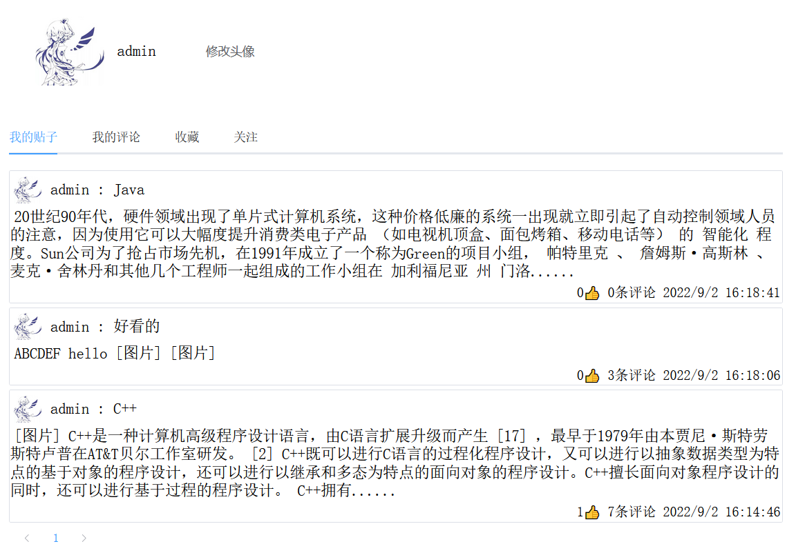
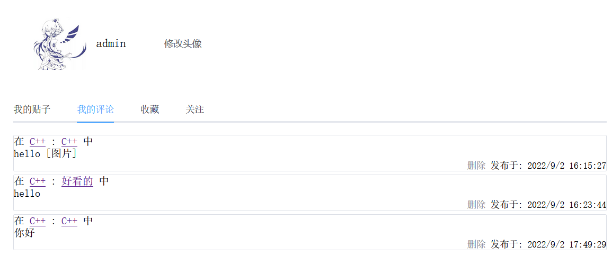
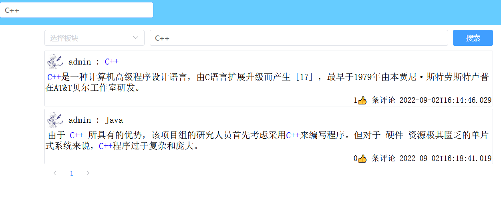
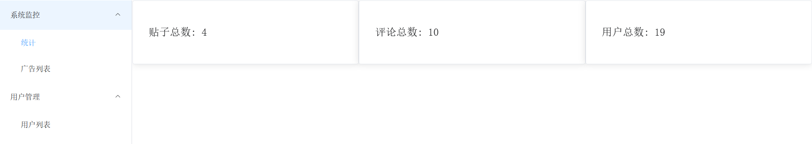
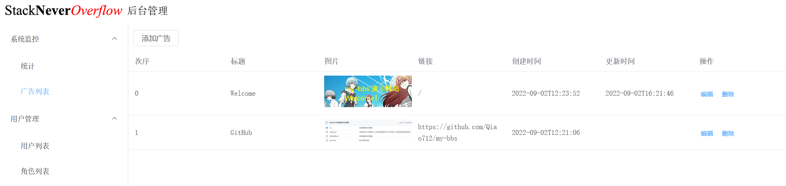

# my-bbs
论坛系统前端

* 暂时将用户端和后台管理放在一起
* 请求的baseURL在 ./src/api/request.js 中设置
## 技术栈
* Vue 3.0.0
* Vue Router 4.1.3
* Vue CLI
* axios 0.27.2
* WangEditor 5.1.14
* element-plus 2.2.12
* dompurify 2.3.10

* 
* 
* 
* 
* 
* 
* 
* 
* 
* 
* 
* 

## Project setup
```
npm install
```
### Compiles and hot-reloads for development
```
npm run serve
```
### Compiles and minifies for production
```
npm run build
```
### Lints and fixes files
```
npm run lint
```
### Customize configuration
See [Configuration Reference](https://cli.vuejs.org/config/).
